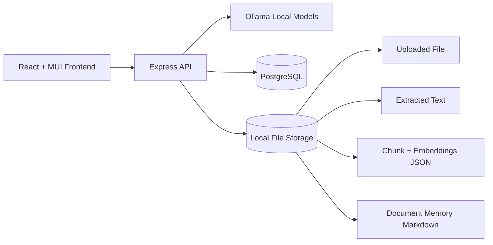
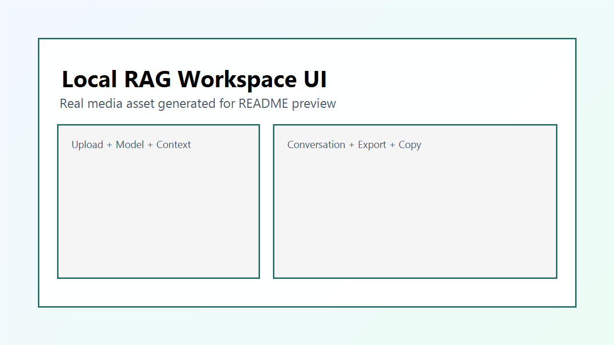
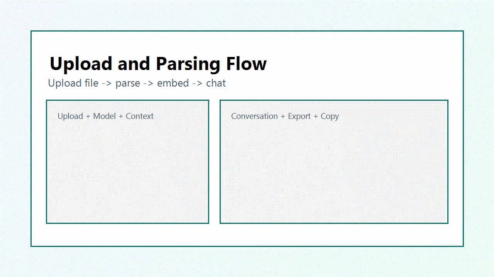
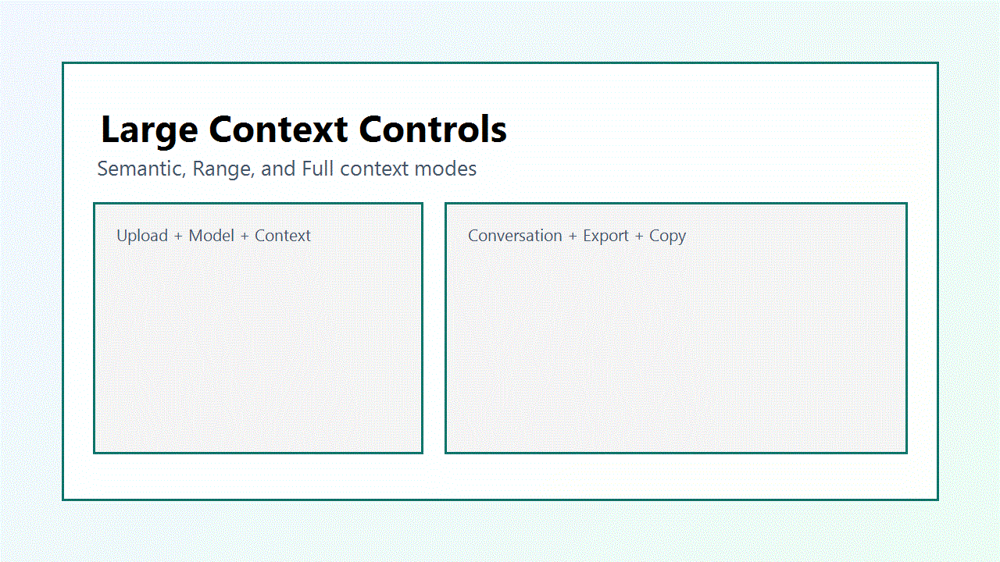

# Local RAG Workspace

[](https://github.com/amitworx/rag-lllm/actions)
[](./LICENSE)
[](https://github.com/amitworx/rag-lllm/stargazers)
[](https://github.com/amitworx/rag-lllm/issues)

Production-ready local document chat app built with React + MUI, Node.js, Ollama, and PostgreSQL.

Upload PDF, images, text files, and Word docs, then chat against the content using your local models. Chat history is persistent, and each document maintains a markdown memory file so follow-up sessions keep useful context.

## At a Glance

- Local-first RAG with Ollama
- PDF/image/TXT/DOCX ingestion
- Context control: Semantic, Range, Full
- Persistent chat sessions in PostgreSQL
- Per-document markdown memory
- Role-based auth and ownership controls
- Copy and export (TXT, DOCX, PDF)
- CI with lint/test/build for frontend and backend

## Quick Start (TL;DR)

```bash
docker compose up -d
ollama pull llama3.1:8b
ollama pull nomic-embed-text
cd backend && npm install && npm run dev
cd ../frontend && npm install && npm run dev
```

Open:

- Frontend: `http://localhost:5173`
- Backend: `http://localhost:4000`

## Table of Contents

1. Overview
2. Core Features
3. Tech Stack
4. Architecture
5. Repository Structure
6. Prerequisites
7. Quick Start
8. Configuration
9. How It Works
10. API Reference
11. Data Model
12. Usage Tips for Very Large Documents
13. Troubleshooting
14. Security and Privacy Notes
15. Screenshots and GIFs
16. Production Deployment (Strict)
17. Roadmap
18. License

## Overview

This project is designed for local-first RAG workflows where data privacy and model control matter.

Key goals:

- Keep all model inference local with Ollama
- Allow flexible context selection for short or huge prompts
- Persist conversation history in PostgreSQL
- Persist lightweight per-document memory in markdown for future sessions
- Provide ergonomic UI actions for copying and exporting answers

## Core Features

- Modern React + MUI web UI
- Upload support for:
  - PDF
  - Images (OCR via Tesseract)
  - TXT
  - DOC/DOCX/ODT (raw text extraction)
- Ollama model picker in the UI
- Context modes:
  - Semantic retrieval (`topK` chunks)
  - Chunk range (`fromChunk` to `toChunk`)
  - Full-context mode with configurable max characters
- Persistent chat sessions and messages in PostgreSQL
- Per-document markdown memory file auto-appended after each Q/A turn
- Copy assistant responses to clipboard
- Export chat transcript as:
  - TXT
  - DOCX
  - PDF

## Tech Stack

- Frontend:
  - React
  - TypeScript
  - Vite
  - MUI
- Backend:
  - Node.js
  - Express
  - TypeScript
- LLM Runtime:
  - Ollama (chat + embeddings)
- Storage:
  - PostgreSQL (session/message metadata and references)
  - Local filesystem (uploaded files, parsed text/chunks, memory markdown)
- Infra:
  - Docker Compose for PostgreSQL

## Architecture



Document ingestion flow:

1. User uploads a file.
2. Backend extracts text based on file type.
3. Text is chunked.
4. Embeddings are generated for each chunk using Ollama embedding model.
5. Metadata is stored in PostgreSQL, chunk data in filesystem.

Chat flow:

1. User selects model + context mode.
2. Backend builds context (semantic/range/full).
3. Backend adds document memory markdown.
4. Prompt is sent to Ollama chat model.
5. User and assistant messages are persisted.
6. Memory markdown is updated for future sessions.

## Repository Structure

```text
.
|-- .github/
|   \-- workflows/
|       \-- ci.yml
|-- backend/
|   |-- src/
|   |   |-- auth.ts
|   |   |-- db.ts
|   |   |-- documentParser.ts
|   |   |-- index.ts
|   |   |-- memoryStore.ts
|   |   |-- ollama.ts
|   |   |-- retrieval.ts
|   |   \-- types.ts
|   |-- tests/
|   |   \-- retrieval.test.ts
|   |-- data/                # runtime data (uploads/parsed)
|   |-- .env.example
|   \-- package.json
|-- frontend/
|   |-- src/
|   |   |-- App.tsx
|   |   |-- main.tsx
|   |   \-- styles.css
|   |-- tests/
|   |   \-- smoke.test.ts
|   \-- package.json
|-- docs/
|   \-- media/
|       |-- ui-overview.png
|       |-- upload-flow.gif
|       \-- large-context.gif
|-- docker-compose.yml
|-- structure.md
|-- LICENSE
\-- README.md
```

## Prerequisites

- Node.js 20+
- npm 10+
- Docker Desktop (or Docker Engine + Compose)
- Ollama installed and running locally

Recommended machine profile for large-context runs:

- RAM: 32 GB+ preferred
- GPU VRAM: depends on chosen model size/context window

## Quick Start

### 1) Clone and enter project

```bash
git clone <your-repo-url>
cd rag-llm
```

### 2) Start PostgreSQL

```bash
docker compose up -d
```

### 3) Start Ollama and pull models

```bash
ollama pull llama3.1:8b
ollama pull nomic-embed-text
```

You can use any chat-capable model in the UI, but embeddings currently use `nomic-embed-text`.

### 4) Configure backend env

Windows PowerShell:

```powershell
cd backend
Copy-Item .env.example .env
```

macOS/Linux:

```bash
cd backend
cp .env.example .env
```

### 5) Install and run backend

```bash
npm install
npm run dev
```

Backend default URL: `http://localhost:4000`

If `AUTH_ENABLED=true`, log in from the UI using `AUTH_USERNAME` and `AUTH_PASSWORD` values from `backend/.env`.

### 6) Install and run frontend

```bash
cd ../frontend
npm install
npm run dev
```

Frontend default URL: `http://localhost:5173`

## Configuration

Backend env variables (`backend/.env`):

```env
PORT=4000
OLLAMA_BASE_URL=http://localhost:11434
POSTGRES_HOST=localhost
POSTGRES_PORT=5432
POSTGRES_DB=rag_llm
POSTGRES_USER=rag_user
POSTGRES_PASSWORD=rag_pass
AUTH_ENABLED=false
AUTH_USERNAME=admin
AUTH_PASSWORD=change-this-password
AUTH_ROLE=admin
JWT_SECRET=change-this-super-secret-key
JWT_EXPIRES_IN=12h
```

Optional frontend env variable:

- `VITE_API_URL` (defaults to `http://localhost:4000`)

Authentication notes:

- When `AUTH_ENABLED=true`, the UI requires login before data access.
- Use `POST /api/auth/login` with configured username/password to obtain JWT.
- All `/api/*` routes except `health` and `auth` endpoints are protected.
- Role-based access:
  - `admin`: can access all documents/sessions/messages
  - `user`: can only access documents they uploaded and related sessions/messages

To add more users in production, insert rows into `app_users` with a bcrypt password hash and role (`admin` or `user`).

## How It Works

### Ingestion

- PDF: parsed text extraction
- Images: OCR extraction via Tesseract
- DOC/DOCX/ODT: text extraction via Mammoth
- TXT and fallback: UTF-8 text read

Extracted text is split into overlapping chunks for retrieval quality. Each chunk gets an embedding and is stored in JSON.

### Context selection modes

- Semantic: retrieves top-N most similar chunks to the user query
- Range: deterministic chunk window for manual control
- Full: pushes large contiguous context up to selected character cap

### Persistent memory

Each document has a markdown memory file in backend parsed storage. After every chat turn, compact notes are appended and injected into future prompts for that same document.

## API Reference

Base URL: `http://localhost:4000`

When authentication is enabled, send `Authorization: Bearer <token>` for protected routes.

For a full route ownership matrix and module-level map, see `structure.md`.

### Health

- `GET /api/health`
  - Response: `{ "ok": true }`

### Models

- `GET /api/models`
  - Response: `{ "models": ["llama3.1:8b", "..."] }`

### Authentication

- `GET /api/auth/config`
  - Returns `{ "enabled": true|false }`

- `POST /api/auth/login`
  - Request body: `{ "username": "...", "password": "..." }`
  - Returns JWT bearer token when auth is enabled
  - Response includes current user role

### Documents

- `GET /api/documents`
  - Lists uploaded documents

- `POST /api/documents/upload`
  - Multipart form-data with field `file`
  - Response includes:
    - `documentId`
    - `sessionId`
    - `chunkCount`

### Sessions and Messages

- `GET /api/documents/:documentId/sessions`
  - Lists sessions for a document

- `GET /api/sessions/:sessionId/messages`
  - Lists messages for a session

### Chat

- `POST /api/chat/:documentId`

Request body example:

```json
{
  "message": "Summarize chapter 3",
  "model": "llama3.1:8b",
  "sessionId": "optional-uuid",
  "context": {
    "mode": "semantic",
    "topK": 12,
    "fromChunk": 0,
    "toChunk": 30,
    "maxChars": 80000
  }
}
```

## Data Model

Tables auto-created on backend start:

- `app_users`
  - login users with role (`admin` or `user`) and bcrypt hash
- `documents`
  - file metadata + parsed artifact paths + `owner_user_id`
- `chat_sessions`
  - document session grouping
- `chat_messages`
  - role-based messages and metadata

Filesystem runtime artifacts:

- Uploaded source files
- Extracted text files
- Chunk+embedding JSON files
- Per-document memory markdown files

## Usage Tips for Very Large Documents

- Start with semantic mode for speed.
- Switch to range mode for deterministic chapter windows.
- Use full mode only when required, and increase `Max Context Characters` gradually.
- Context capacity is constrained by model window and machine resources; bigger is not always better.
- For 1500+ page books, chapter-by-chapter range mode often gives better latency and answer quality.

## Troubleshooting

### Ollama models not listed

- Verify Ollama service is running.
- Verify `OLLAMA_BASE_URL` is correct.
- Pull at least one chat model and `nomic-embed-text`.

### Upload works but chat fails

- Confirm embedding model is available: `ollama list`.
- Check backend logs for parsing/OCR/model errors.
- Try smaller `maxChars` first.

### PostgreSQL connection errors

- Ensure Docker container is healthy: `docker compose ps`.
- Verify credentials in `backend/.env` match `docker-compose.yml`.

### Slow responses on huge context

- Reduce `maxChars`.
- Lower `topK`.
- Prefer range mode for targeted retrieval.
- Use a model with faster inference profile.

## Security and Privacy Notes

- This app is local-first and intended for trusted environments.
- JWT authentication is supported and can be enabled with `AUTH_ENABLED=true`.
- Do not expose backend publicly without enabling auth, rate limiting, and strict input hardening.

## Screenshots and GIFs

Starter media assets are included under `docs/media/`. Replace them with real product captures from your environment when you are ready.

### UI overview



Suggested capture:

- Left panel: upload + model selector + context controls
- Right panel: conversation with copy/export actions

### Upload and parsing flow (GIF)



Suggested capture:

- Upload PDF/image/doc
- Wait for ingestion
- First question and answer

### Large context controls (GIF)



Suggested capture:

- Toggle Semantic/Range/Full
- Increase max context characters
- Compare output behavior

## Detailed Reference

If you want the complete implementation map (component/module ownership and route behavior by role), see `structure.md`.

## Production Deployment (Strict)

This section is intentionally opinionated for safer internet-facing deployments.

### 1) Reverse proxy

Use NGINX, Caddy, or Traefik in front of the backend and frontend.

Required controls:

- TLS termination
- Request body limits (for upload endpoints)
- Timeouts tuned for long-running LLM requests
- Header hardening (`X-Frame-Options`, `X-Content-Type-Options`, `Referrer-Policy`)
- Access logs and error logs enabled

### 2) Authentication and authorization

Minimum for production:

- Add user authentication (OIDC/JWT/session-based)
- Scope access to document/session ownership
- Require auth for all `/api/*` routes except health
- Add CSRF protection if using cookie-based sessions

### 3) HTTPS and network policy

- Enforce HTTPS redirects
- Disable plain HTTP externally
- Restrict database to private network only
- Restrict backend egress if required by policy
- Run services behind firewall/security groups with least privilege

### 4) Secrets management

- Do not commit `.env`
- Use secret manager or runtime-injected environment variables
- Rotate credentials periodically
- Separate credentials per environment (dev/stage/prod)

### 5) Storage and backups

You must back up both DB and filesystem artifacts.

Back up:

- PostgreSQL database (`documents`, `chat_sessions`, `chat_messages`)
- `backend/data/uploads`
- `backend/data/parsed` (includes memory markdown and chunks)

Recommended plan:

- Nightly full backup
- Point-in-time recovery for Postgres where possible
- Offsite encrypted backup copy
- Quarterly restore drill to verify recovery

### 6) Application hardening

- Add rate limiting per IP and per user
- Add request validation (zod/joi) on all API payloads
- Add upload MIME + extension validation and file size caps
- Add antivirus scanning in high-risk environments
- Add structured logging and trace IDs
- Add health and readiness checks for orchestrators

### 7) Observability and operations

- Metrics: request latency, error rate, token usage, queue times
- Alerting: high 5xx, DB connectivity, Ollama unavailability
- Dashboards for upload throughput and response latency
- Define SLOs for availability and p95 latency

### 8) Compliance checklist (starter)

- Data retention policy for chat and uploaded files
- Audit logging for sensitive actions
- Document deletion workflow (hard delete)
- Incident response runbook

### 9) Example deployment topology

```text
Internet
  -> Reverse Proxy (TLS, WAF rules, auth gateway)
    -> Frontend static app
    -> Backend API (private network)
      -> Ollama runtime (private)
      -> PostgreSQL (private, no public ingress)
      -> Persistent volume for uploaded/parsing artifacts
```

### 10) Pre-go-live checklist

- [ ] Auth enabled and tested
- [ ] HTTPS enforced
- [ ] Secrets externalized and rotated
- [ ] Backups automated and restore-tested
- [ ] Logging/metrics/alerts operational
- [ ] File upload constraints validated
- [ ] Pen-test or security review completed

## Roadmap

- Streaming token responses in UI
- Session rename/create/delete in UI
- Better retrieval indexing for very large corpora
- Background ingestion queue and progress tracking
- Optional auth layer for multi-user deployments

## License

Add your preferred license file (for example MIT) before publishing publicly.
